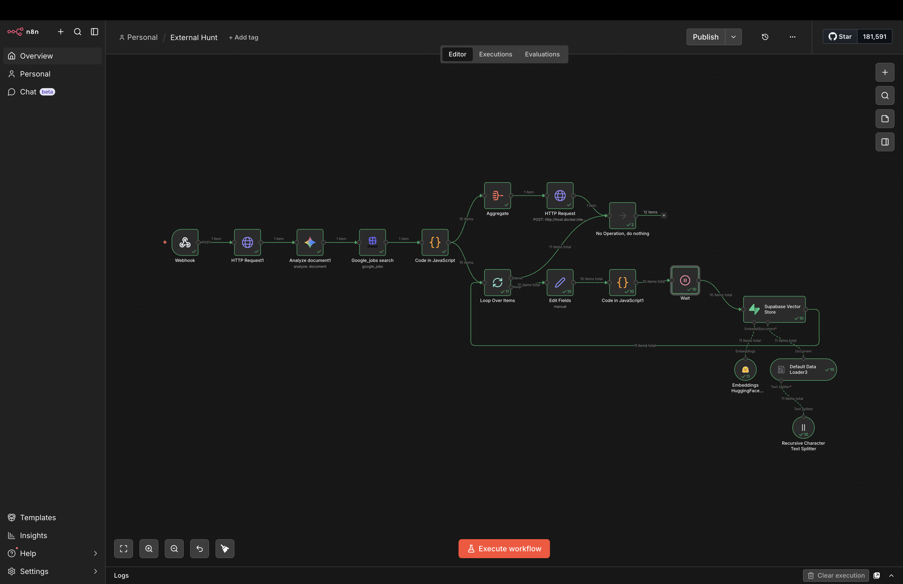
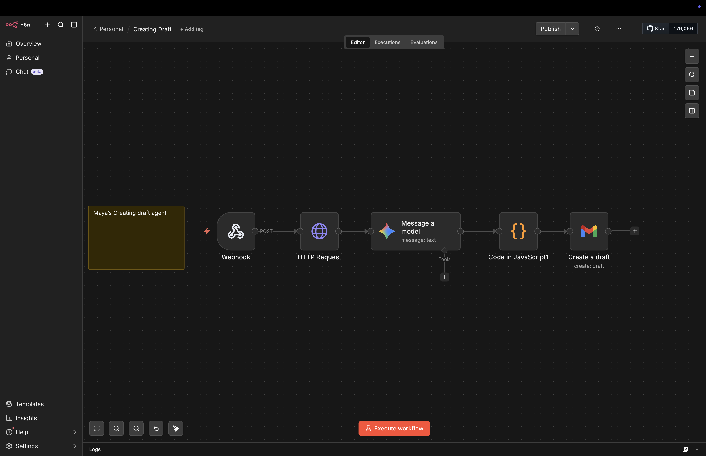

Here is the clean, high-quality **README.md** incorporating your specific workflow image filenames. You can copy and paste this directly into your project.

# VectorHire 🛰️

**VectorHire** is an AI-driven recruitment intelligence platform designed to bridge the gap between candidate resumes and real-time market opportunities. Featuring **Agent Maya**, an autonomous discovery engine, the system crawls professional networks to find, index, and draft applications for high-probability job matches.

## 🚀 The Core Engines

### 1. Discovery Engine (Hunt & Sync)

Maya analyzes your resume context to perform deep-crawls across professional networks, indexing leads directly into a PostgreSQL cluster.




### 2. Action Engine (Draft & Personalize)

Once a job is found, Maya utilizes the job description and your neural profile to generate a "perfect-fit" cold email draft.



---

## 🚀 Key Features

* **Agent Maya:** An autonomous agent powered by n8n and Gemini LLM that crawls the web for job listings based on your specific resume context.
* **Neural Sync:** Seamless synchronization between low-code automation (n8n) and a high-performance Next.js/Prisma/PostgreSQL backend.
* **Dynamic Dashboard:** Glassmorphic UI built with Tailwind CSS and Framer Motion for real-time visualization of job discoveries.
* **Secure Authentication:** Robust user management and session handling via Better Auth.

## 🛠️ Tech Stack

* **Frontend:** Next.js 15+ (App Router), Tailwind CSS, Framer Motion, Lucide Icons.
* **Backend:** Node.js, Prisma ORM, PostgreSQL.
* **Automation:** n8n (Self-hosted), Gemini 1.5 Flash (via Google AI Studio).
* **Communication:** RESTful APIs, Webhooks.

## ⚙️ Architecture & n8n Integration

VectorHire uses a distributed architecture to handle heavy web-crawling tasks without blocking the main application thread.

1. **Trigger:** The user initiates a "Global Hunt" from the Next.js dashboard.
2. **Webhook:** Next.js sends a secure POST request to an **n8n Webhook node**.
3. **Intelligence:** n8n parses the resume URL, uses **Gemini** to extract keywords, and executes a search via **SerpApi/Google Jobs**.
4. **Ingestion:** n8n cleans the results and sends a bulk JSON payload back to the `/api/agent/external` endpoint.
5. **Persistence:** The Next.js backend performs a high-efficiency `createMany` operation with `skipDuplicates` logic in Prisma.

## 📦 Installation

1. **Clone the repository:**
```bash
git clone https://github.com/BarunMahato/vectorhire.git
cd vectorhire

```


2. **Install dependencies:**
```bash
npm install

```


3. **Set up Environment Variables:**
Create a `.env` file:
```env
DATABASE_URL="your-postgresql-url"
AGENT_SECRET_KEY="your-secure-key"
BETTER_AUTH_SECRET="your-auth-secret"
NEXT_PUBLIC_APP_URL="http://localhost:3000"

```


4. **Run Migrations:**
```bash
npx prisma migrate dev
npm run dev

```


## 🛡️ License

MIT

---

Developed with ❤️ by [Barun Mahato](https://www.google.com/search?q=https://github.com/BarunMahato)

---
