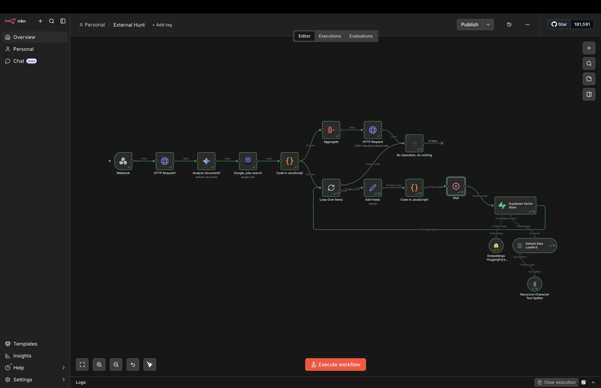
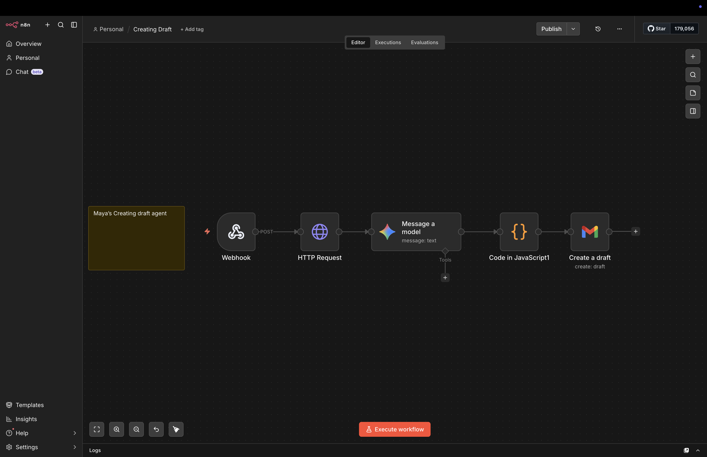
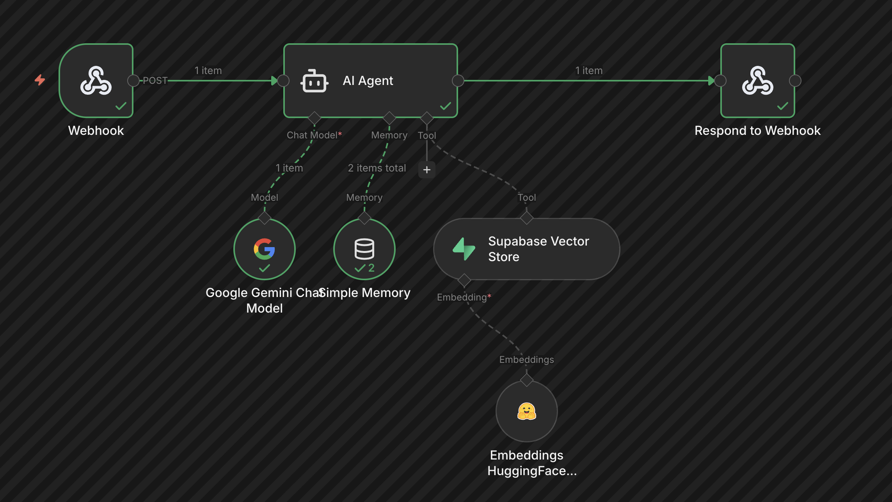

# VectorHire 🛰️

**VectorHire** is an AI-driven recruitment intelligence platform designed to seamlessly bridge the gap between candidate resumes and real-time market opportunities.

At the heart of the platform is  n8n Agent, an autonomous discovery engine that continuously crawls professional networks to find, index, and draft highly personalized applications for your best-fit job matches. Stop searching for jobs, and let VectorHire hunt for you.

## 🚀 The Core Engines

### 1. Discovery Engine (Hunt & Sync)

The agent analyzes your resume context to perform deep-crawls across professional networks, indexing leads directly into a Supabase for querying by our chat agent apart from this it also stores the data in externalJobs section so the data can be seen in frontend.




### 2. Action Engine (Draft & Personalize)

Once a job is found, Maya utilizes the job description and your neural profile to generate a "perfect-fit" cold email draft.




### 3. AI Career Assistant Workflow

There is a chat-assistant page in our platform whereby if you send some query it goes to n8n agent and it does embedding of it with hugging face and runs a query in our database making the 


---

## 🚀 Key Features

* **Agent Maya:** An autonomous agent powered by n8n and Gemini LLM that crawls the web for job listings based on your specific resume context.
* **Neural Sync:** Seamless synchronization between low-code automation (n8n) and a high-performance Next.js/Prisma/PostgreSQL backend.
* **Dynamic Dashboard:** Glassmorphic UI built with Tailwind CSS and Framer Motion for real-time visualization of job discoveries.
* **Secure Authentication:** Robust user management and session handling via Better Auth.

## 🛠️ Tech Stack

* **Frontend:** Next.js (App Router), Tailwind CSS, Framer Motion, Lucide Icons.
* **Backend:** Node.js, Prisma ORM, PostgreSQL.
* **Automation:** n8n (Self-hosted), Gemini 1.5 Flash (via Google AI Studio).
* **Database:** Neon(Postgres)
* **Communication:** Webhooks.
* **Pdf Upload:** UploadThing

## ⚙️ Architecture & n8n Integration

VectorHire uses a distributed architecture to handle heavy web-crawling tasks without blocking the main application thread.

1. **Trigger:** The user initiates a "Global Hunt" from the Next.js dashboard.
2. **Webhook:** Next.js sends a secure POST request to an **n8n Webhook node**.
3. **Intelligence:** n8n parses the resume URL, uses **Gemini** to extract keywords, and executes a search via **SerpApi/Google Jobs**.
4. **Ingestion:** n8n cleans the results and sends a bulk JSON payload back to the `/api/agent/external` endpoint.
5. **Persistence:** The Next.js backend performs a high-efficiency `createMany` operation with `skipDuplicates` logic in Prisma.

## 📦 Installation

1. **Clone the repository:**
```bash
git clone https://github.com/BarunMahato/vectorhire.git
cd vectorhire

```


2. **Install dependencies:**
```bash
npm install
```

If you deleted `node_modules`, this command recreates it from `package-lock.json`.

3. **Set up Environment Variables:**
Copy `.env.example` to `.env` and fill in your own values:
```bash
cp .env.example .env
```

Required keys include `DATABASE_URL`, `BETTER_AUTH_SECRET`, `BETTER_AUTH_URL`, `NEXT_PUBLIC_APP_URL`, Google OAuth credentials, UploadThing token, and your n8n webhook URLs.

4. **Generate Prisma Client and Run Migrations:**
```bash
npm run db:generate
npm run db:migrate
```

5. **Start the Development Server:**
```bash
npm run dev
```

Useful verification commands:
```bash
npm run typecheck
npm run lint
```


## 🛡️ License

MIT

---

Developed with ❤️ by [Barun Mahato](https://www.google.com/search?q=https://github.com/BarunMahato)

---
